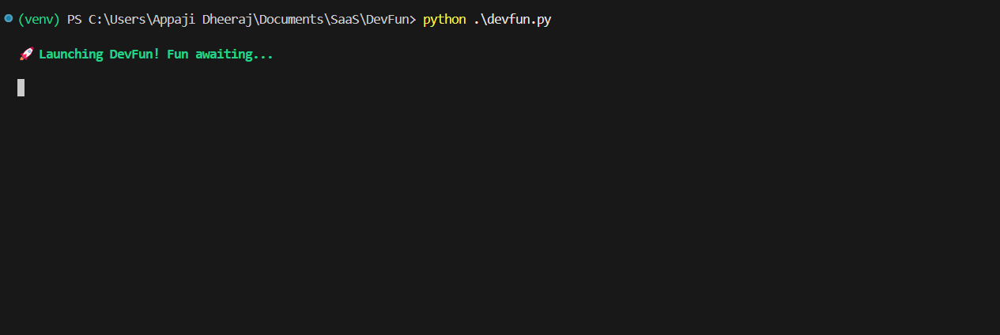
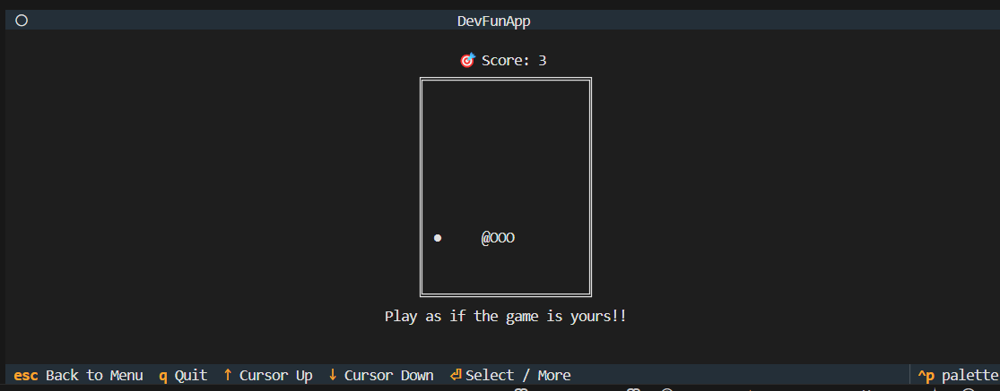
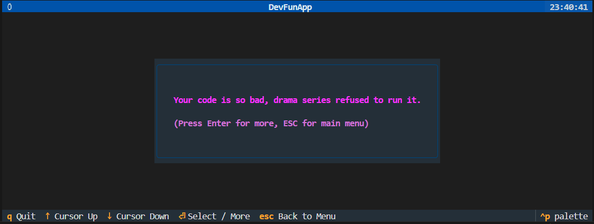
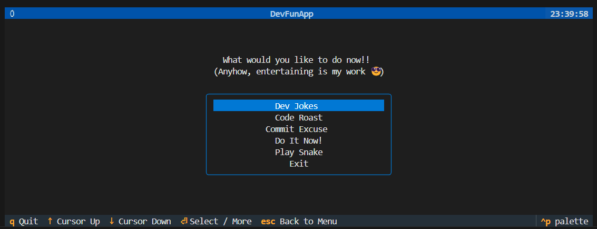

# 😎 DevFun — Your Daily Dose of Developer Humor, Right in the Terminal

Welcome to **DevFun**, a humorous and interactive terminal app that delivers jokes, roasts, excuses, and motivation tailored for developers — because coding shouldn't be all work and no play.

Built with [Textual](https://www.textualize.io/), `DevFun` turns your terminal into a fun zone with beautifully styled UI and snappy interactions.


---

## 🎯 Features

- 🤡 **Dev Jokes** — Classic programming humor to lighten the mood.
- 🔥 **Code Roasts** — Brutally honest feedback… with a comedic twist.
- 🧑‍💻 **Commit Excuses** — Justifications no one asked for but you needed.
- ⚡ **Do It Now!** — Motivational one-liners to crush procrastination.
- 💅 **Stylish Terminal UI** using [Textual](https://github.com/Textualize/textual)

---

## 🚀 Getting Started

### 1. Clone the Repository

```bash
git clone https://github.com/appajidheeraj/devfun.git
cd devfun
```

### 2. Create & Activate a Virtual Environment

```bash
python -m venv venv
source venv/bin/activate  # On Windows: venv\Scripts\activate
```

### 3. Install Dependencies
```bash
pip install -r requirements.txt
```

### 4. Run the App
```bash
python devfun.py
```

## 🧰 Project Structure

```bash
devfun/
├── cli.py              # Main terminal UI using Textual
├── cli.tcss            # UI styling
├── devfun.py           # Entry point
├── requirements.txt    # Python dependencies
├── tools/              # All feature modules
│   ├── code_roast.py
│   ├── commit_excuse.py
│   ├── dev_jokes.py
│   └── do_it_now.py
└── utils.py            # Reserved for shared utilities (currently empty)
```
---

## 📦 Dependencies
- textual — For creating beautiful TUI apps

- rich — For advanced terminal formatting

- httpx — For API calls (jokes & excuses)

## 🌐 APIs Used
- Official Joke API — Programming jokes

- WhatTheCommit — Random commit messages

- APIs are optional — fallback data is available offline if no internet connection.

---

## 📸 Preview

<table>
  <tr>
    <td align="center"></td>
    <td align="center"></td>
  </tr>
  <tr>
    <td align="center"></td>
    <td align="center"></td>
  </tr>
</table>

---

## 💡 Inspiration
This project was born from a simple idea:

"Why not bring humor and motivation to the developer's terminal — where they live most of their day?"

Whether you're debugging a nasty error or pushing your fifth "final" commit, DevFun is here to bring a smile (or a roast).

## 🤝 Contributing
Pull requests and suggestions are welcome!
If you have a great idea for a new feature or better joke, feel free to fork and contribute!

## 👨‍💻 Author
Made with 💙 by Appaji Dheeraj
